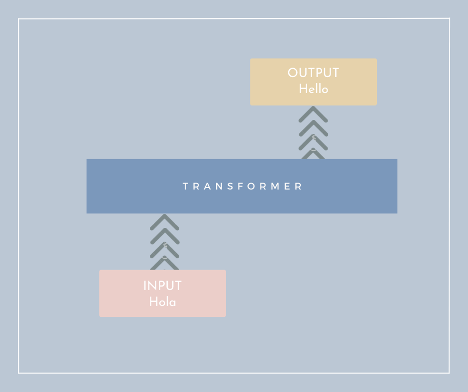
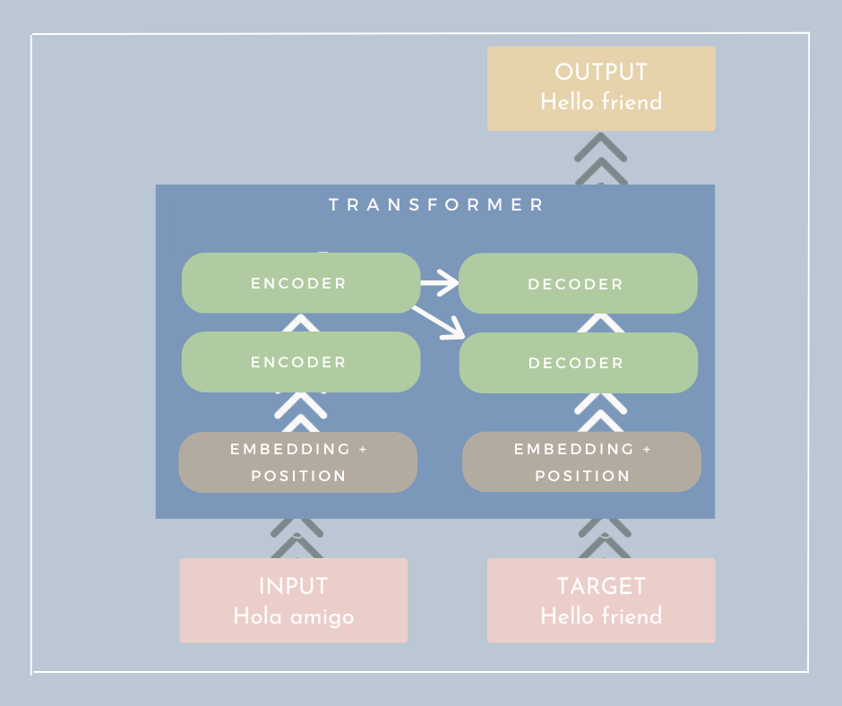
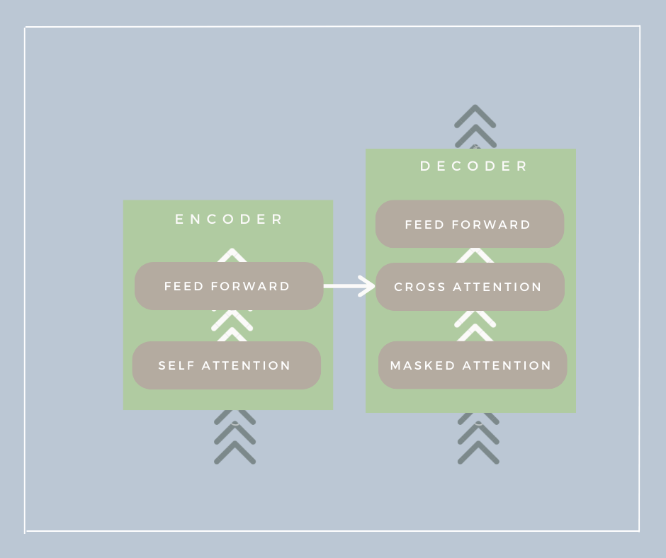

import arquitecturaTransformerImg from "./img/transformers_arquitectura.png";
import ejemploSalidaImg from "./img/22200013.jpg";

# Transformers

Los transformers empezaron en lenguaje, pero hoy se usan en muchos campos: Visión Artificial, Redes Generativas, Aprendizaje por Refuerzo, series temporales y más. En muchos casos han logrado resultados de referencia. Su impacto es tan grande que se han convertido en una pieza central del Machine Learning.

La arquitectura completa de un transformer puede parecer compleja al principio.

Pero para una primera toma de contacto, podemos verlo de forma muy simple:

Si pensamos en el modelo como una caja negra, sería simplemente:

Entrada -> Transformer -> Salida

Si hacemos zoom:
La entrada pasa por varios **Encoders** (uno tras otro) y su salida llega a varios **Decoders**, hasta producir la salida final. En el paper original se usan 6 encoders y 6 decoders.

En entrenamiento aparece un bloque llamado **Target**: ahí damos al modelo la salida esperada para que aprenda. En inferencia (uso real), no le damos la respuesta completa.

¿Pero qué es un encoder y un decoder?
Un **encoder** es la parte que "entiende" la entrada.

Un **decoder** es la parte que "genera" la salida.

Por dentro, tanto encoder como decoder incluyen un bloque de **atención** (la idea revolucionaria del transformer) y capas neuronales.

## Qué hace internamente

1. **Tokenización**: convierte el texto en unidades más pequeñas (tokens). Estas pueden ser palabras, subpalabras o incluso caracteres, dependiendo del modelo.
	`Tokenización -> texto -> tokens`
2. **Embeddings**: transforma los tokens en vectores numéricos.
3. **Capa de atencion**: permite al modelo decidir qué palabras son más importantes entre sí. Cada token puede "mirar" al resto para entender el contexto.
	Se calculan relaciones entre todos los tokens para entender mejor el contexto.
	El paper *Attention Is All You Need* explica esta parte, que es la mas innovadora y diferenciadora.
4. **Capa de salida**: produce la prediccion final.
	Puede clasificar (por ejemplo positivo/negativo), pero tambien puede generar texto, traducir, resumir, responder preguntas, etc.
	A veces se implementa con softmax o sigmoid, dependiendo de la tarea.

	

  <em>Ejemplo de salida generada por un transformer</em>

## Es similar a una red neuronal clásica?

Si, pero con una arquitectura especifica (transformer) y con tecnicas avanzadas como la atencion.

## Diferencias frente a una red neuronal tradicional

1. En deep learning clasico no hay una fase de tokenizacion porque normalmente no trabaja texto de esta manera.
2. Ambas pueden usar embeddings (sobre todo en NLP). En imagenes suele usarse otra representacion.
3. En redes tradicionales, el contexto suele modelarse con convoluciones o recurrentes. En transformers, la atencion relaciona todos los elementos del texto entre si para capturar contexto global.
4. Ambas tienen capa de salida. En transformers es muy comun que la salida sea texto (no solo una etiqueta de clase).

## Idea principal de los transformers

La principal diferencia de los transformers es **como obtienen el contexto**: con atencion sobre todas las partes de la secuencia.

## Ejercicios prácticos

**IMPORTANTE**: Guarda una copia en Drive antes de empezar (Archivo → Guardar una copia)

# Bibliografía
* https://www.aprendemachinelearning.com/como-funcionan-los-transformers-espanol-nlp-gpt-bert/