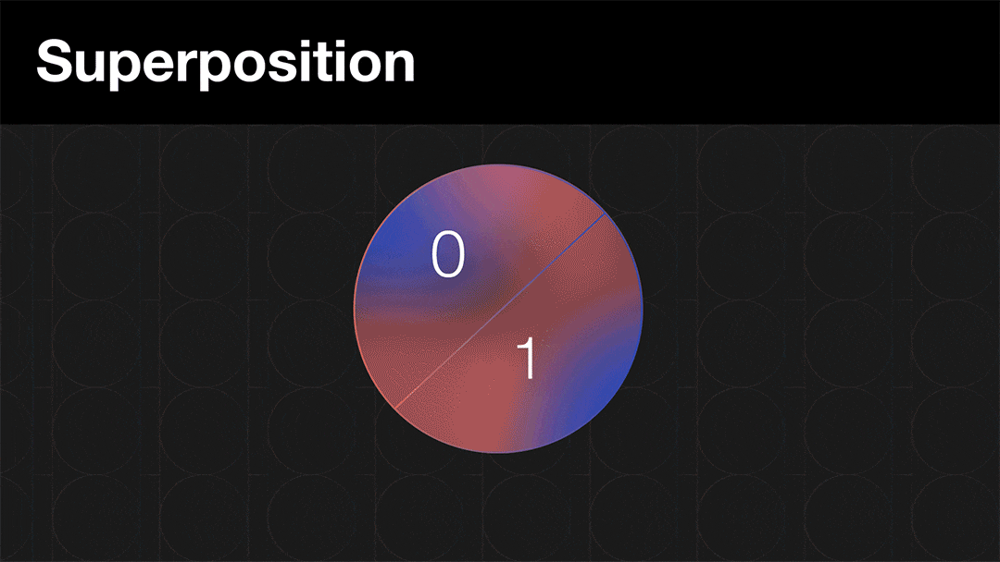
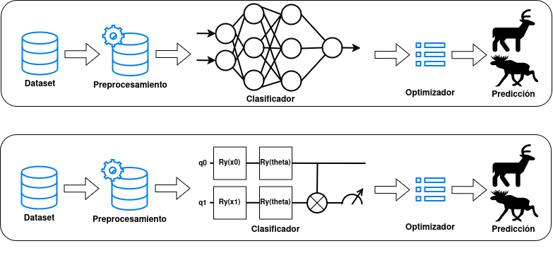

import quantumvsclassical from "./img/ZQktuz.gif";
import classicalml from "./img/classicalML.pdf";

# Quantum Machine Learning (QML)

La idea de QML no es reemplazar el Machine Learning clásico, sino combinarlo con la computación cuántica.

## 1. Computación clásica vs cuántica

- En computación clásica trabajamos con bits: `0` o `1`.
- En computación cuántica trabajamos con qubits, que pueden representar combinaciones de `0` y `1` gracias a la superposición y el entrelazamiento.

No significa que un ordenador cuántico sea mejor en todo, pero sí que puede abrir nuevas formas de representar y procesar información al poder explorar múltiples soluciones al mismo tiempo.

## 2. Superposición (explicado fácil)

Un qubit no está solo en `0` o solo en `1`, sino en una combinación de ambos estados hasta que se mide.

Forma intuitiva de verlo:
- Bit clásico: interruptor apagado o encendido.
- Qubit: una "mezcla" de apagado y encendido que, al medir, colapsa a uno de los dos resultados.

Esto permite diseñar modelos que exploren representaciones más complejas con pocos qubits.

## 3. Entrelazamiento

Dos qubits entrelazados quedan correlacionados de forma muy fuerte: al medir uno, la información del otro deja de ser independiente.

- Sin entrelazamiento: cada qubit aporta información "por separado".
- Con entrelazamiento: el circuito puede modelar interacciones entre variables (algo parecido a capturar relaciones no lineales), si uno cambia, el otro también.

Por eso en QML suele ser una pieza clave cuando queremos mejorar capacidad de clasificación.

## 4. Pipeline ML clásico vs pipeline QML

Mismo pipeline, diferente modelo en una parte concreta.

Pipeline típico en ML clásico:
1. Cargar datos
2. Preprocesar (normalizar, separar train/test)
3. Entrenar clasificador clásico (Logistic Regression, SVM, red neuronal, etc.)
4. Evaluar

Pipeline en QML (híbrido):
1. Cargar datos
2. Preprocesar (igual que en clásico)
3. Codificar datos en un circuito cuántico
4. Entrenar parámetros del circuito (con optimizador clásico)
5. Evaluar

Conclusión:
- No cambia todo el flujo.
- Lo que cambia es el modelo: el clasificador pasa a ser un circuito cuántico parametrizado.

Es decir, QML es un enfoque híbrido: clásico + cuántico ([algoritmos variacionales](https://matheuscammarosanohidalgo.medium.com/a-very-simple-variational-quantum-classifier-vqc-64e8ec26589d)).

La QPU prepara los estados y la CPU actualiza los parámetros.

## 5. Circuito como capas en Machine Learning

En ML clasico, una red hace algo asi:

`entrada -> capa lineal -> activacion -> capa lineal -> salida`

En QML, el clasificador se puede pensar parecido, pero las "capas" son puertas cuanticas:

`entrada -> rotaciones RY/RZ -> (opcional entrelazamiento) -> medida -> salida`

La idea es:
- `RY(x1*pi)` y `RZ(x2*pi)`: meten los datos de entrada en el circuito (feature encoding).
- `RY(theta)`: parametro entrenable del modelo (como un peso en ML clasico).
- `measure`: convierte el estado cuantico en una salida observable (por ejemplo, probabilidad de clase 1).

Forma corta para explicarlo en clase:
- `x1, x2` son los datos.
- `theta` es lo que aprende el modelo durante el entrenamiento.
- La prediccion final depende de como queden combinados `x1, x2` y `theta` tras las rotaciones y la medida.

En algunos problemas, QML puede necesitar menos parámetros entrenables (`theta`) que un modelo clásico, porque parte de su expresividad viene de la superposición y el entrelazamiento. Aun así, no es una ventaja garantizada en todos los casos: depende de la tarea, del circuito y del hardware disponible.

## 6. ¿Para qué sirve hoy y por qué conocerlo?

Estado actual:
- Es una tecnología emergente.
- Aún hay limitaciones de hardware (ruido, pocos qubits útiles, coste).
- No sustituye al ML clásico en la mayoría de problemas reales actuales.

Por qué tiene sentido aprenderlo ahora:
- Introduce una forma distinta de pensar modelos y representaciones.
- Te prepara para futuras herramientas y perfiles profesionales.
- Ya se investiga en clasificación, optimización, química computacional y finanzas.