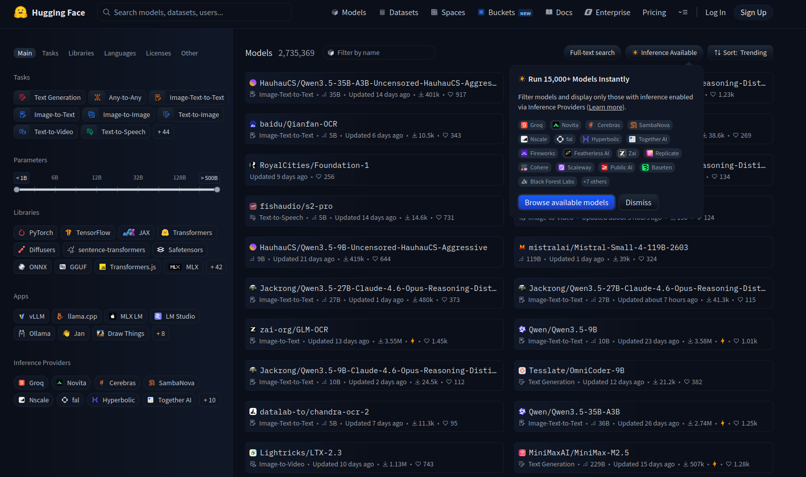
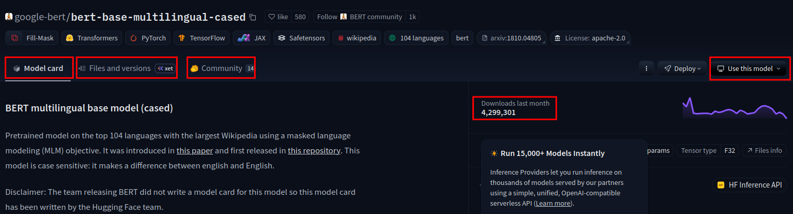

import task from "./img/task.png";
import lang from "./img/lang.png";
import filter from "./img/filter.png";

# Hugging Face

## ¿Qué es Hugging Face?

Hugging Face es una empresa y plataforma que se ha convertido en el **centro de referencia** para la comunidad de Machine Learning. Aunque empezó enfocándose en NLP (procesamiento de lenguaje natural), hoy abarca prácticamente todas las áreas del aprendizaje automático.

**¿Qué ofrece Hugging Face?**

1. **Model Hub**: Un repositorio gigantesco de modelos preentrenados (más de 500.000 modelos)
2. **Datasets Hub**: Miles de datasets listos para usar
3. **Spaces**: Demos interactivas de modelos
4. **Bibliotecas**: `transformers`, `datasets`, `tokenizers`, `diffusers`, etc.
5. **Comunidad**: Foros, papers, cursos gratuitos

En esencia, Hugging Face facilita el uso de Machine Learning, permitiendo usar modelos avanzados sin tener que entrenarlos desde cero.

## Model Hub

El [Model Hub](https://huggingface.co/models) es un repositorio donde la comunidad sube y comparte modelos preentrenados.



### ¿Para qué sirve?

- **Descargar modelos** listos para usar en tareas específicas
- **Comparar modelos** por métricas, popularidad, tamaño
- **Filtrar** por tarea (clasificación, traducción, generación de texto, etc.), framework (PyTorch, TensorFlow), idioma, licencia...
- **Ver la documentación** de cada modelo: cómo usarlo, ejemplos, limitaciones

### Estructura de un modelo en el Hub

Cada modelo tiene su propia Model Card con:

| Sección | Descripción |
|---------|-------------|
| **Model Card** | Descripción, uso previsto, limitaciones, sesgos |
| **Files** | Pesos del modelo, configuración, tokenizer |
| **Usage** | Código de ejemplo para usarlo |
| **Metrics** | Resultados en benchmarks |
| **Community** | Discusiones y feedback |



### Ejemplo de búsqueda

Si necesitas un modelo para **análisis de sentimiento en español**:

1. Ir a [huggingface.co/models](https://huggingface.co/models)
2. Filtrar por tarea: `Text Classification`
3. Filtrar por idioma: `Spanish`
4. Ordenar por descargas o likes
5. Revisar las Model Cards de los candidatos

Los modelos más descargados suelen ser los más probados por la comunidad.

<div style={{ display: "grid", gridTemplateColumns: "1fr 1fr", gap: "20px", margin: "30px 0" }}>
  <div style={{ textAlign: "center" }}>
    <strong>Paso 2: Filtrar por tarea (Task)</strong>
    
  </div>
  <div style={{ textAlign: "center" }}>
    <strong>Paso 3: Filtrar por idioma (Language)</strong>
    
  </div>
</div>

<div style={{ textAlign: "center", margin: "30px 0" }}>
  <strong>Paso 4: Ver resultados filtrados</strong><br />
  
</div>

## Pipelines

Los **pipelines** son la forma más sencilla de usar modelos de Hugging Face. Abstraen toda la complejidad (tokenización, modelo, post-procesado) en una sola línea de código. Es una API de alto nivel para usar modelos fácilmente.

### ¿Por qué usar pipelines?

- **Simplicidad**: No necesitas conocer los detalles internos del modelo
- **Productividad**: En pocas líneas tienes un modelo funcionando
- **Flexibilidad**: Puedes cambiar de modelo fácilmente

### Instalación

```bash
pip install transformers
```

### Ejemplo básico: Análisis de sentimiento

```python
from transformers import pipeline

# Crear el pipeline (descarga el modelo automáticamente la primera vez)
clasificador = pipeline("sentiment-analysis")

# Usar el pipeline
resultado = clasificador("Me encanta este helado de chocolate")
print(resultado)
# [{'label': 'POSITIVE', 'score': 0.9998}]
```

### Tareas disponibles

Los pipelines cubren muchas tareas comunes:

| Tarea | Pipeline | Ejemplo de uso |
|-------|----------|----------------|
| Análisis de sentimiento | `sentiment-analysis` | Detectar si un texto es positivo/negativo |
| Clasificación de texto | `text-classification` | Clasificar texto en categorías |
| Generación de texto | `text-generation` | Completar o generar texto |
| Respuesta a preguntas | `question-answering` | Responder preguntas sobre un texto |
| Resumen | `summarization` | Resumir textos largos |
| Traducción | `translation` | Traducir entre idiomas |
| Reconocimiento de entidades | `ner` | Extraer personas, lugares, organizaciones... |
| Clasificación de imágenes | `image-classification` | Clasificar imágenes |
| Detección de objetos | `object-detection` | Detectar objetos en imágenes |
| Transcripción de audio | `automatic-speech-recognition` | Convertir audio a texto |

### Especificar un modelo concreto

Por defecto, cada pipeline usa un modelo predeterminado. Pero puedes especificar cualquier modelo del Hub:

```python
from transformers import pipeline

# Usar un modelo específico para español
clasificador = pipeline(
    "sentiment-analysis",
    model="nlptown/bert-base-multilingual-uncased-sentiment"
)

resultado = clasificador("Esto lo cambia todo")
print(resultado)
```

### Ejemplo: Generación de texto
**No** es lo mismo que [Fill-Mask](https://colab.research.google.com/github/jorgecs/apuntes/blob/main/docs/ut5_ia_aplicada/1_transformers/notebooks/Transformer.ipynb#scrollTo=rcag6ntkta), la generación de texto continúa donde termina la frase, mientras que Fill-Mask puede rellenar palabras en el medio (tarea de comprensión vs tarea de generación).

```python
from transformers import pipeline

generador = pipeline("text-generation", model="gpt2")

texto = generador(
    "The cake is",
    max_length=50,
    num_return_sequences=1
)
print(texto[0]['generated_text'])
```

### Ejemplo: Respuesta a preguntas

```python
from transformers import pipeline

qa = pipeline("question-answering")

contexto = """
Hugging Face fue fundada en 2016 en Nueva York.
Inicialmente era una app de chatbot, pero pivotó hacia
herramientas de NLP y se convirtió en la plataforma
de referencia para modelos de Machine Learning.
"""

pregunta = "¿Cuándo se fundó Hugging Face?"

respuesta = qa(question=pregunta, context=contexto)
print(respuesta)
# {'answer': '2016', 'score': 0.98, 'start': 30, 'end': 34}
```

### Pipeline con imágenes

```python
from transformers import pipeline

# Clasificación de imágenes
clasificador_img = pipeline("image-classification")

resultado = clasificador_img("imagen_gato.jpg")
print(resultado)
# [{'label': 'Egyptian cat', 'score': 0.89}, ...]
```

### Pipeline con audio

```python
from transformers import pipeline

# Transcripción de audio (Speech-to-Text)
transcriptor = pipeline("automatic-speech-recognition", model="openai/whisper-base")

resultado = transcriptor("audio.mp3")
print(resultado["text"])
```

## ¿Qué hace un pipeline?

Un pipeline hace automáticamente estos pasos:

1. **Preprocesado**: Tokeniza el texto (o procesa la imagen/audio)
2. **Modelo**: Pasa los datos por el modelo (inferencia)
3. **Postprocesado**: Convierte la salida en algo legible (etiquetas, scores, texto...)

```
Entrada -> Tokenizer -> Modelo -> Postprocesado -> Salida
```

Estos pasos los veremos en detalle en los ejercicios, usando cada componente por separado para tener más control.

## Ejercicios prácticos

[](https://colab.research.google.com/github/jorgecs/apuntes/blob/main/docs/ut5_ia_aplicada/2_huggingface/notebooks/Pipeline.ipynb)

**IMPORTANTE**: Guarda una copia en Drive antes de empezar (Archivo → Guardar una copia)

## Bibliografía

- [Documentación oficial de Hugging Face](https://huggingface.co/docs)
- [Curso gratuito de Hugging Face](https://huggingface.co/learn/nlp-course)
- [Model Hub](https://huggingface.co/models)
