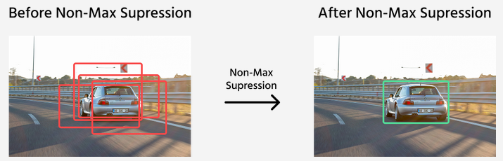
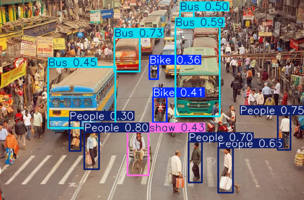

## Clasificación a detección con YOLO

Objetivo de esta sesión: entender por qué **clasificar** una imagen no es lo mismo que **detectar** objetos, y cómo YOLO representa esto con **bounding boxes** en imágenes y vídeo.

### Clasificación vs detección

- **Clasificación**: responde "qué hay en la imagen" (una etiqueta global).
- **Detección**: responde "qué hay" y "dónde está" (clase + posición por objeto).

Ejemplo:

- Imagen con dos coches y una persona.
- Clasificación: `"street"` o `"car"`.
- Detección: `car(x1,y1,x2,y2)`, `car(...)`, `person(...)`.

Si quieres actuar sobre el mundo (contar, seguir, evitar colisiones, vigilar zonas), necesitas ubicación, no solo etiqueta.

### Qué es una Bounding Box

Una **bounding box** es un rectángulo que delimita un objeto. No es un dibujo, sino una **lista de números**.

YOLO suele devolver, por cada objeto:

- `class_id`: Qué objeto es (0: persona, 1: coche...).
- `confidence`: Qué seguridad tiene el modelo (de 0.0 a 1.0).
- `bbox`: Las coordenadas del rectángulo. El formato más común es `[x1, y1, x2, y2]`:
    - `(x1, y1)`: Esquina superior izquierda.
    - `(x2, y2)`: Esquina inferior derecha.

Normalmente, el punto `(0,0)` está en la **esquina superior izquierda**. A medida que `y` aumenta, bajamos en la imagen.

YOLO puede trabajar con píxeles reales o con valores **normalizados** (de 0.0 a 1.0), lo que permite que el modelo funcione igual de bien independientemente del tamaño de la imagen.

### El Grid en YOLO

YOLO no escanea la imagen trozo a trozo:

1. Divide la imagen en una **rejilla (grid)** (ej. 13x13 o 19x19).
2. Cada celda de esa rejilla es "responsable" de predecir si hay un objeto cuyo **centro** caiga dentro de ella.
3. Si una celda detecta algo, predice la caja, la confianza y qué objeto es.

Esto permite procesar todo en una sola pasada, lo que permite que funcione en **tiempo real**.

### ¿Qué sabe detectar? (Dataset COCO)

Por defecto, los modelos que usamos suelen estar pre-entrenados con el dataset **COCO** (*Common Objects in Context*), que incluye **80 categorías** comunes (personas, coches, señales de tráfico, animales, muebles...).


Parámetros que incluye YOLO:

- **IoU (Intersection over Union)**: cuánto se solapan dos cajas.
- **NMS (Non-Max Suppression)**: elimina cajas duplicadas para un mismo objeto.
- Umbrales típicos de inferencia:
  - `conf`: filtro por confianza.
  - `iou`: control del NMS.



### Demostración con imagen

Cuando ejecutamos el modelo, obtenemos una lista de detecciones. Podemos usar `.plot()` para verlo rápido, o inspeccionar los números para hacer lógica.

```python
from ultralytics import YOLO

# 1. Cargamos el modelo (se descarga automáticamente)
model = YOLO("yolov8n.pt") 

# 2. Hacemos la predicción sobre una imagen
# Usamos [0] porque predict devuelve una lista, y solo queremos el primer resultado
resultado = model.predict("clase.jpg", conf=0.4)[0]

# 3. OPCIÓN A: Ver el resultado rápido (abre una ventana propia)
resultado.show() 

# 4. OPCIÓN B (más importante): Acceder a los datos para lógica (conteo, etc.)

#Obtenemos cuántas detecciones ha habido
detecciones = resultado.boxes
print(f"Se han detectado {len(detecciones)} objetos.")

for box in detecciones: # Puede haber más de una caja!

    # Con .xyxy obtenemos las coordenadas en formato [x1, y1, x2, y2]
    x1, y1, x2, y2 = box.xyxy[0].tolist()
    # .conf nos da la confianza del modelo
    conf = box.conf[0]
    # .cls nos da el identificador de la clase
    cls = int(box.cls[0])
    # .names es un diccionario que mapea ids a nombres
    label = model.names[cls]

    # Se puede filtrar por clase usando algo como:
    # if label in ["person"]: 

    print(f"Detectado {label} con confianza {conf:.2f}")
```



Una imagen puede tener **múltiples detecciones**.
Cada detección tiene su propia caja y confianza.
Cambiar `conf` altera cantidad/calidad de cajas.

### Mismo concepto con vídeo

Aquí no cambia la idea, solo se repite frame a frame. Aquí usamos OpenCV, es una librería para visualización y gestión de las imágenes (nos permitirá abrir la imagen y mostrar la caja en las coordenadas que YOLO ha detectado).

```python
import cv2
from ultralytics import YOLO

# 1. Cargamos el modelo
model = YOLO("yolov8n.pt")

# 2. Abrimos el vídeo
cap = cv2.VideoCapture("video.mp4")

while cap.isOpened():
    # Leemos el frame
    ok, frame = cap.read()
    if not ok:
        break

    # 3. Predicción sobre el frame actual (igual que en imagen)
    resultado = model.predict(frame, conf=0.35)[0]

    # 4. Visualización con OpenCV
    # .plot() dibuja las cajas y nos devuelve la imagen (numpy array)
    frame_dibujado = resultado.plot()

    # También podemos acceder a los datos como antes
    detecciones = resultado.boxes
    
    for box in detecciones:
        x1, y1, x2, y2 = box.xyxy[0].tolist()
        conf = box.conf[0]
        cls = int(box.cls[0])
        label = model.names[cls]
        print(f"Detectado {label} con confianza {conf:.2f}")

        # Es exactamente igual que en imagen pero iterando por cada frame, pero podemos mostrar esos frames
    
        # OpenCV permite dibujar las cajas, podemos hacer un rectángulo indicando la posición (x1, y1, x2, y2), el color (RGB) y el grosor de la línea
        cv2.rectangle(frame_dibujado, (int(x1), int(y1)), (int(x2), int(y2)), (255, 0, 0), 2)

        # También podemos añadir texto, en este caso la etiqueta, la posición, la fuente, el tamaño, color y grosor del texto
        cv2.putText(frame_dibujado, model.names[cls], (int(x1), int(y1)), cv2.FONT_HERSHEY_SIMPLEX, 0.5, (255, 0, 0), 2)

    # Mostramos el frame con OpenCV
    cv2.imshow("Detecciones en tiempo real", frame_dibujado) # En Google Colab es cv2_imshow(frame_dibujado)
    # En google Colab podemos usar también: clear_output(wait=True) para limpiar y mostrar la imagen nueva en lugar de esperar la tecla 'q'.

    # Dejar de mostrar el frame si pulsamos 'q'
    if cv2.waitKey(1) & 0xFF == ord("q"):
        break

# Cerramos el vídeo y destruimos todas las ventanas
cap.release()
cv2.destroyAllWindows()
```

### Modelos de la comunidad (Hugging Face)

Aunque Ultralytics nos da modelos oficiales, la comunidad entrena modelos para tareas específicas (detectar solo caras, detectar matrículas, etc.).

Estos modelos se descargan usando `hf_hub_download`

```python
from huggingface_hub import hf_hub_download

# ruta en Hugging Face: "usuario/nombre-modelo" y el archivo del modelo que se encuentra en Files and versions
model_path = hf_hub_download(
    repo_id="nombre-usuario/nombre-modelo",
    filename="yolov8m.pt"
)

model = YOLO(model_path)
```

## Ejercicios prácticos

[](https://colab.research.google.com/github/jorgecs/apuntes/blob/main/docs/ut5_ia_aplicada/4_yolo/notebooks/YOLO.ipynb)

**IMPORTANTE**: Guarda una copia en Drive antes de empezar (Archivo → Guardar una copia)