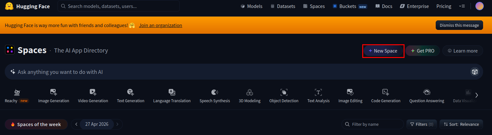
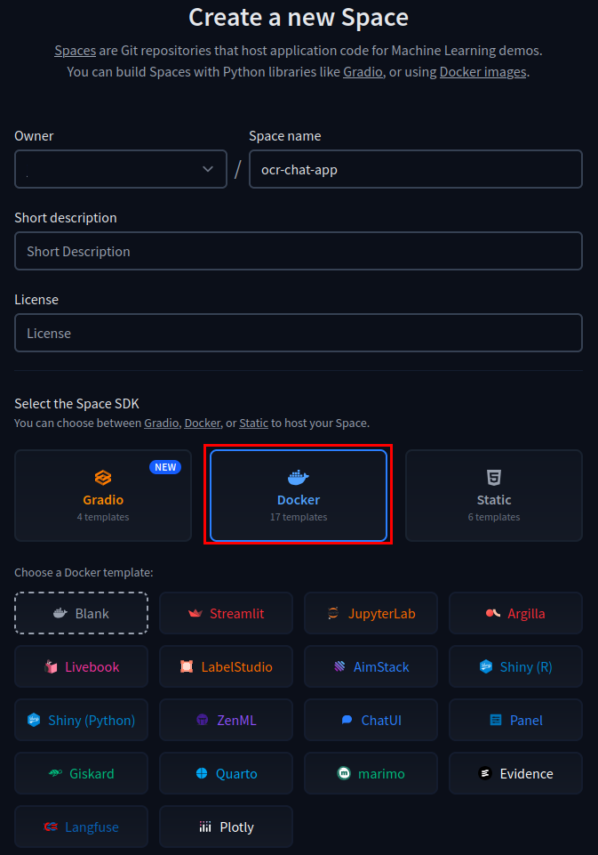
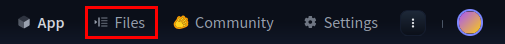
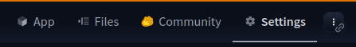
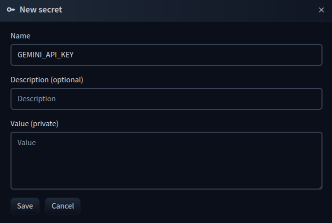

En esta sección, aprenderemos a desplegar nuestra aplicación en [Hugging Face Spaces](https://huggingface.co/spaces). 

Para comenzar, accede a la plataforma y crea un nuevo espacio siguiendo estos pasos:

1. Haz clic en **Create new Space**.
   

2. Selecciona **Docker** como entorno de ejecución.
   

3. Dirígete a la pestaña **Files** para gestionar los archivos de tu proyecto.
   

### Configuración de variables de entorno (Secrets)

Dado que Hugging Face Spaces gestiona las variables de entorno de forma segura a través de **Secrets**, ya no necesitamos cargar el archivo `.env` localmente. Por lo tanto, debes **eliminar** las siguientes líneas de código de tu backend:

```python
from dotenv import load_dotenv
load_dotenv()
```

En su lugar, configuraremos la variable de entorno directamente en la plataforma, pega en **value** la API Key que tienes:

1. Ve a la pestaña **Settings**.

   

2. Añade un nuevo *Secret* con tu API Key.

   

### Ajustes en el código del servidor (`main.py`)

Hugging Face Spaces puede servir el frontend de manera más eficiente si configuramos correctamente el montaje de archivos estáticos. Por ello, debes **eliminar** la ruta principal que utilizábamos para servir el archivo `index.html`:

```python
@app.get("/")
def home():
    return FileResponse("static/index.html")
```

A continuación, debes **añadir o modificar** la línea encargada de servir los ficheros estáticos por la siguiente:

```python
app.mount("/", StaticFiles(directory="static", html=True), name="static")
```

**Muy importante**, asegúrate de que esta línea de código que acabas de modificar se encuentre al **FINAL** de tu fichero `main.py`.

### Estructura del proyecto

Hugging Face Spaces espera que los archivos de la aplicación estén organizados con la siguiente estructura:

```text
/
│── main.py
│── requirements.txt
│── Dockerfile
│
└── static/
    │── index.html
    │── script.js   (si tienes)
    └── style.css   (si tienes)
```

Para facilitar el proceso, crea un archivo `requirements.txt` que contenga todas las dependencias necesarias para esta UT. Puedes copiar y pegar lo siguiente:
```text
fastapi==0.136.1
uvicorn==0.46.0
python-multipart==0.0.27
opencv-python-headless==4.13.0.92
numpy==2.2.6
paddleocr==2.10.0
paddlepaddle==2.6.2
pytesseract==0.3.13
ultralytics==8.4.45
google-genai==1.73.1
huggingface_hub==1.12.2
transformers==5.7.0
requests==2.33.1
```


Por último, necesitarás crear un `Dockerfile`. Este archivo es el responsable de configurar el entorno, instalar Tesseract y las librerías de sistema necesarias para OpenCV. Copia y pega el siguiente contenido:

```docker
FROM python:3.10

WORKDIR /app

# Instalar tesseract en el sistema
RUN apt-get update && apt-get install -y \
    tesseract-ocr \
    && rm -rf /var/lib/apt/lists/*

# Instalar dependencias para OpenCV
RUN apt-get update && apt-get install -y \
    libgl1 \
    libglib2.0-0 \
    && rm -rf /var/lib/apt/lists/*    

# Copiar e instalar las dependencias de Python
COPY requirements.txt .
RUN pip install --no-cache-dir -r requirements.txt

# Copiar el código del proyecto
COPY . .

# Exponer el puerto que usa Hugging Face Spaces
EXPOSE 7860

# Comando para arrancar la aplicación con Uvicorn
CMD ["uvicorn", "main:app", "--host", "0.0.0.0", "--port", "7860"]
```

Subiendo todos estos archivos a [Hugging Face Spaces](https://huggingface.co/spaces) ya tendremos nuestra aplicación desplegada y accesible públicamente.

La URL será algo parecido a: 

`https://usuario-nombre-espacio.hf.space`